Folder highlights
Project files detail a real-time collaborative task management app using React, TypeScript, and Postgres, with a demo user seeded.

# TaskFlow User Guide

A comprehensive guide to using TaskFlow - your collaborative task management application.

---

## Table of Contents

1. [Getting Started](#getting-started)
   - [Creating an Account](#creating-an-account)
   - [Logging In](#logging-in)
   - [Google Sign-In](#google-sign-in)
2. [Dashboard Overview](#dashboard-overview)
3. [Task Management](#task-management)
   - [Creating a Task](#creating-a-task)
   - [Editing a Task](#editing-a-task)
   - [Deleting a Task](#deleting-a-task)
   - [Duplicating a Task](#duplicating-a-task)
4. [Task Stages & Workflow](#task-stages--workflow)
   - [Marking as In Progress](#marking-as-in-progress)
   - [Marking as Completed](#marking-as-completed)
   - [Moving Back to TODO](#moving-back-to-todo)
5. [Task Assignment](#task-assignment)
   - [Assigning Tasks to Team Members](#assigning-tasks-to-team-members)
   - [Pending Assignments](#pending-assignments)
6. [Subtasks](#subtasks)
   - [Adding Subtasks](#adding-subtasks)
   - [Completing Subtasks](#completing-subtasks)
7. [Activity & Comments](#activity--comments)
8. [Views & Filtering](#views--filtering)
   - [Board View](#board-view)
   - [List View](#list-view)
   - [Filtering Tasks](#filtering-tasks)
9. [Notifications](#notifications)
10. [Trash & Recovery](#trash--recovery)
11. [Profile Settings](#profile-settings)
12. [Keyboard Shortcuts](#keyboard-shortcuts)

---

## Getting Started

### Creating an Account

To start using TaskFlow, you need to create an account:

1. Navigate to the TaskFlow login page
2. Click on the **"Sign Up"** tab
3. Fill in the registration form:
   - **Full Name**: Your display name
   - **Email**: Your email address
   - **Password**: Create a secure password (minimum 8 characters)
4. Click the **"Create Account"** button
5. You'll be automatically logged in and redirected to the Dashboard

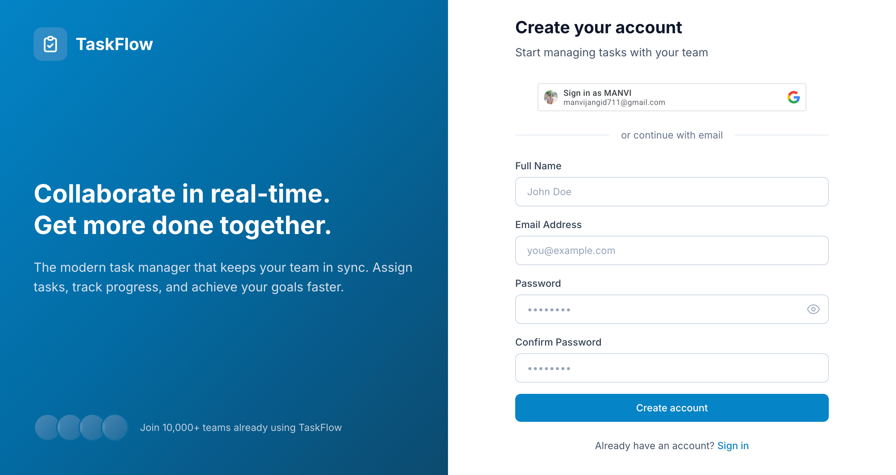

---

### Logging In

If you already have an account:

1. Navigate to the TaskFlow login page
2. Ensure you're on the **"Sign In"** tab
3. Enter your credentials:
   - **Email**: Your registered email address
   - **Password**: Your account password
4. Click the **"Sign In"** button
5. Upon successful authentication, you'll be redirected to the Dashboard

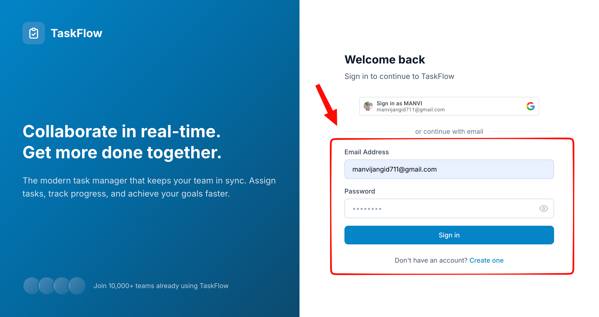

---

### Google Sign-In

TaskFlow supports one-click sign-in with Google:

1. Navigate to the TaskFlow login page
2. Click the **"Sign in with Google"** button
3. Select your Google account in the popup window
4. Grant necessary permissions if prompted
5. You'll be automatically logged in and redirected to the Dashboard

**Note**: If this is your first time signing in with Google, an account will be automatically created for you using your Google profile information.

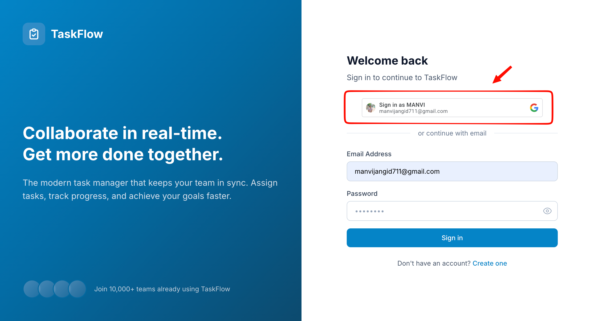

---

## Dashboard Overview

The Dashboard is your home base, providing a quick overview of all your tasks.

### Key Components

| Component | Description |
|-----------|-------------|
| **Statistics Cards** | Display total tasks, completed tasks, in-progress tasks, and to-do tasks |
| **Priority Chart** | Visual bar chart showing task distribution by priority level |
| **Recent Tasks** | Quick access list of your most recently created or updated tasks |

### Statistics Cards

The top section displays four cards with real-time counts:

- **Total Tasks**: All active tasks (not trashed)
- **Completed**: Tasks marked as completed
- **In Progress**: Tasks currently being worked on
- **To Do**: Tasks not yet started

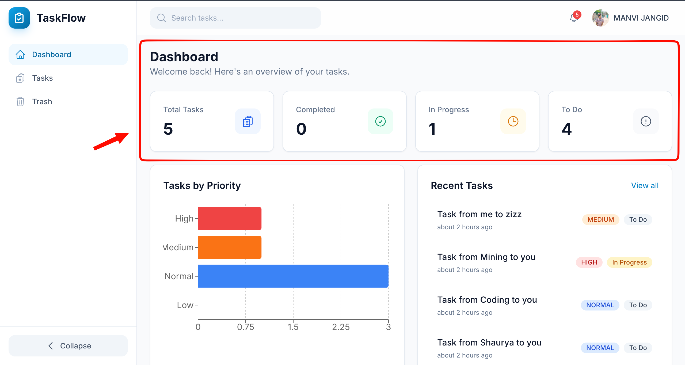

### Priority Chart

The bar chart visualizes how your tasks are distributed across priority levels:

- **High** (Red): Urgent tasks requiring immediate attention
- **Medium** (Yellow): Important but not urgent tasks
- **Normal** (Blue): Standard priority tasks
- **Low** (Gray): Tasks that can be done when time permits

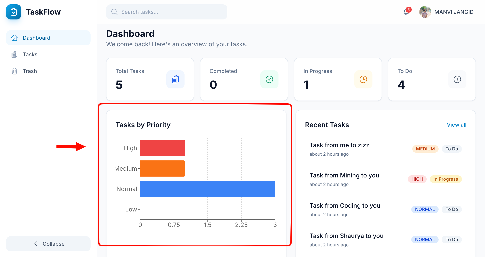

---

## Task Management

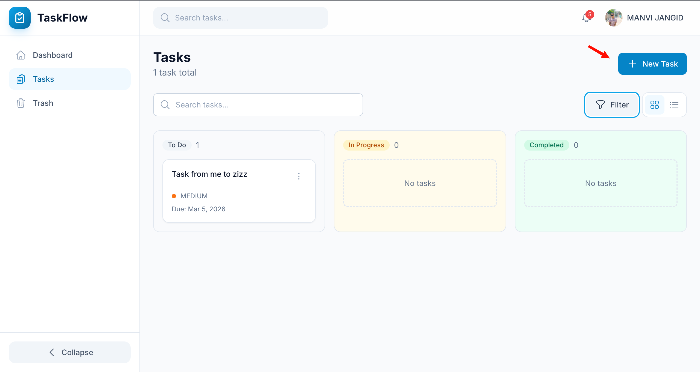

### Creating a Task

To create a new task:

1. Click the **"+ Create Task"** button in the sidebar or top navigation
2. The task creation modal will appear
3. Fill in the task details:

| Field | Required | Description |
|-------|----------|-------------|
| **Title** | Yes | A clear, descriptive name for the task |
| **Description** | No | Detailed information about the task |
| **Priority** | Yes | HIGH, MEDIUM, NORMAL, or LOW |
| **Stage** | Yes | TODO, IN_PROGRESS, or COMPLETED |
| **Due Date** | No | Optional deadline for the task |
| **Assignee** | No | Team member to assign this task to |

4. Click **"Create Task"** to save

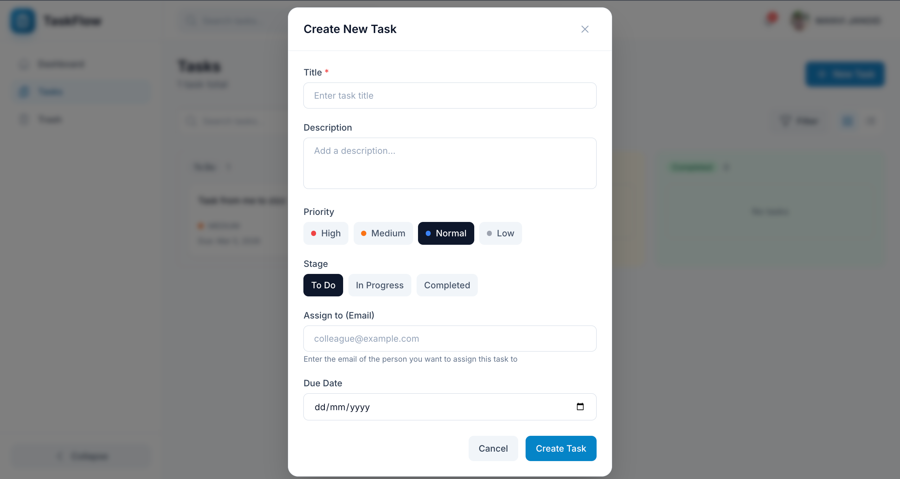

#### Priority Levels Explained

| Priority | When to Use | Visual Indicator |
|----------|-------------|------------------|
| **High** | Urgent, blocking issues, critical deadlines | Red badge |
| **Medium** | Important but can wait a day or two | Yellow badge |
| **Normal** | Regular tasks with flexible timelines | Blue badge |
| **Low** | Nice-to-have, backlog items | Gray badge |

---

### Editing a Task

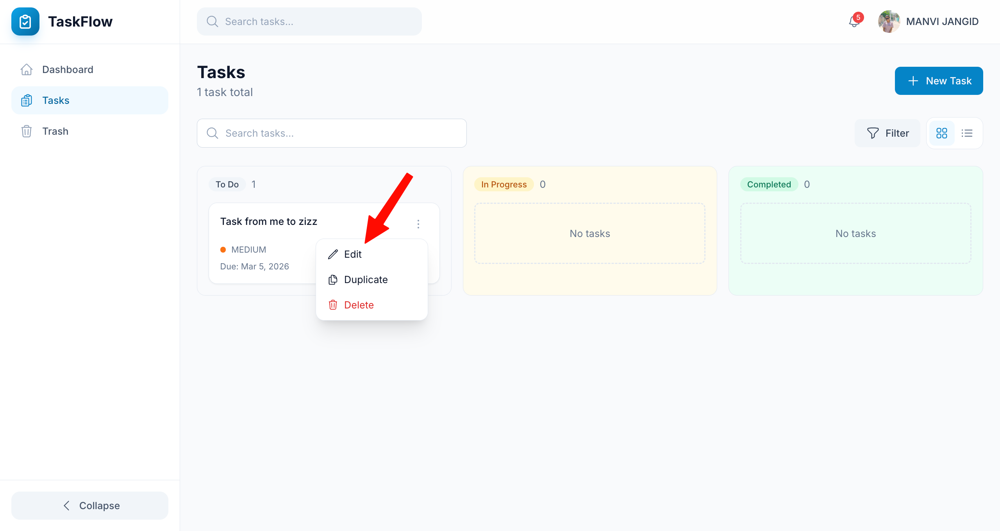

To modify an existing task:

1. Navigate to the task you want to edit
2. Click on the task card to open the Task Detail view
3. Click the **"Edit"** button (pencil icon) in the top right
4. The edit modal will appear with current values pre-filled
5. Make your changes to any field:
   - Title
   - Description
   - Priority
   - Stage
   - Due Date
   - Assignee
6. Click **"Update Task"** to save changes

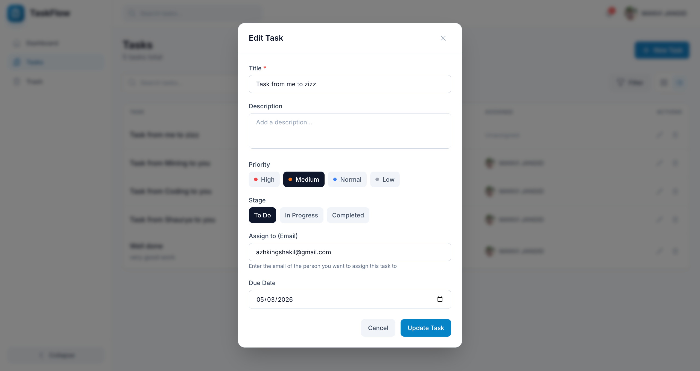

**Tip**: Changes are saved immediately and reflected in real-time across all connected users.

---

### Deleting a Task

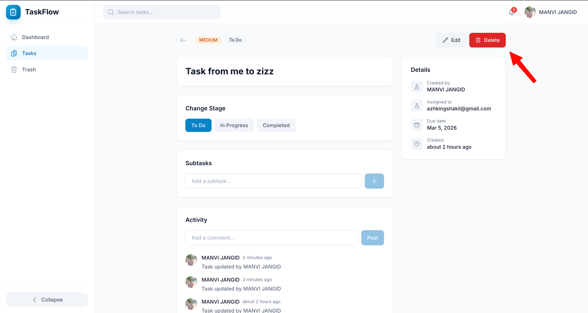

TaskFlow uses a two-step deletion process to prevent accidental data loss:

#### Step 1: Move to Trash (Soft Delete)

1. Open the task you want to delete
2. Click the **"Delete"** button (trash icon)
3. Confirm the action in the popup dialog
4. The task is moved to Trash and hidden from normal views

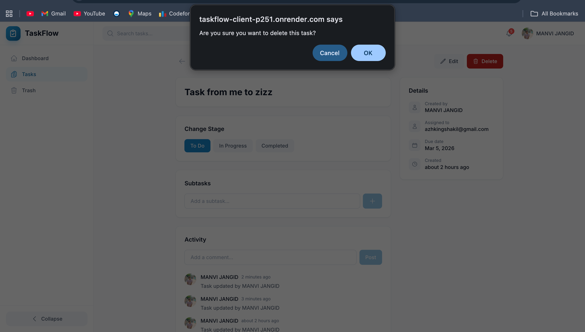

#### Step 2: Permanent Delete

1. Navigate to **Trash** in the sidebar
2. Find the task you want to permanently remove
3. Click the **"Delete Forever"** button
4. Confirm the permanent deletion
5. The task is permanently removed from the database

**Warning**: Permanent deletion cannot be undone!

---

### Duplicating a Task

To create a copy of an existing task:

1. Open the task you want to duplicate
2. Click the **"Duplicate"** button (copy icon)
3. A new task is created with:
   - Same title with "(Copy)" appended
   - Same description, priority, and assignee
   - Stage reset to TODO
   - New creation timestamp
4. Edit the duplicated task as needed

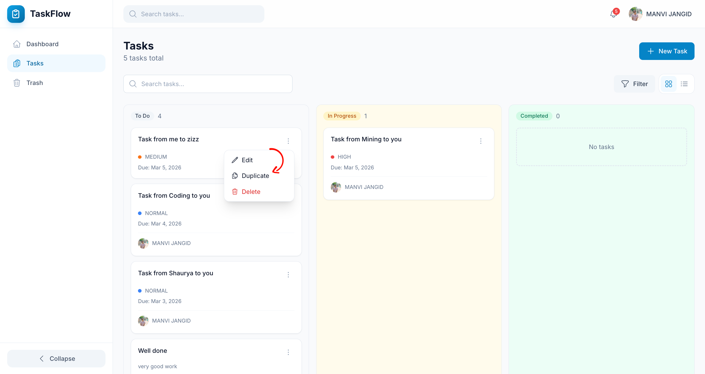

---

## Task Stages & Workflow

Tasks in TaskFlow follow a workflow with three stages:

```
┌─────────┐      ┌─────────────┐      ┌───────────┐
│  TODO   │ ───► │ IN_PROGRESS │ ───► │ COMPLETED │
└─────────┘      └─────────────┘      └───────────┘
     ▲                  │                   │
     │                  │                   │
     └──────────────────┴───────────────────┘
            (Can move back to any stage)
```

### Marking as In Progress

When you start working on a task:

#### Method 1: From Task Detail

1. Open the task by clicking on it
2. Click the **"Start Progress"** button or stage dropdown
3. Select **"In Progress"**
4. The task moves to the In Progress column/section

#### Method 2: From Board View

1. In Board View, find the task in the TODO column
2. Drag and drop the task card to the **IN PROGRESS** column
3. The stage updates automatically

#### Method 3: Quick Action

1. Hover over a task card
2. Click the **play icon** (▶) for quick stage change
3. Select **"In Progress"**

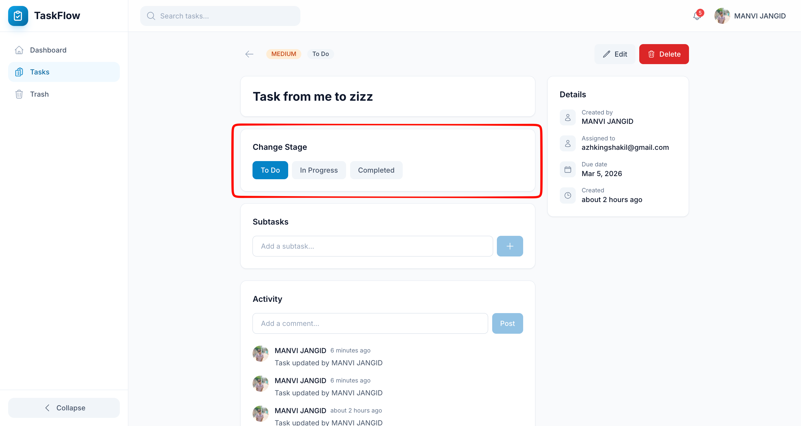

**What happens when a task is marked In Progress:**

- Stage badge changes to yellow "IN PROGRESS"
- Activity log records the change
- Task appears in "In Progress" count on Dashboard
- Assigned user receives a notification (if not already notified)

---

### Marking as Completed

When you finish a task:

#### Method 1: From Task Detail

1. Open the task by clicking on it
2. Click the **"Mark Complete"** button or stage dropdown
3. Select **"Completed"**
4. The task moves to the Completed column/section

#### Method 2: From Board View

1. In Board View, find the task
2. Drag and drop the task card to the **COMPLETED** column
3. The stage updates automatically

#### Method 3: Quick Action

1. Hover over a task card
2. Click the **checkmark icon** (✓) for quick completion
3. Task is immediately marked as completed

**What happens when a task is completed:**

- Stage badge changes to green "COMPLETED"
- Activity log records completion with timestamp
- Task creator receives a completion notification
- Dashboard statistics update in real-time
- Completion percentage updates if subtasks exist

---

### Moving Back to TODO

If you need to reopen a task:

1. Open the completed or in-progress task
2. Click the stage dropdown
3. Select **"TODO"**
4. The task returns to the TODO stage

**Use cases for reverting:**

- Task was marked complete by mistake
- Requirements changed after completion
- Need to redo work after review

---

## Task Assignment

### Assigning Tasks to Team Members

You can assign tasks to specific team members:

#### During Task Creation

1. Click **"+ Create Task"**
2. Fill in task details
3. In the **Assignee** field, start typing a name or email
4. Select the team member from the dropdown
5. Click **"Create Task"**

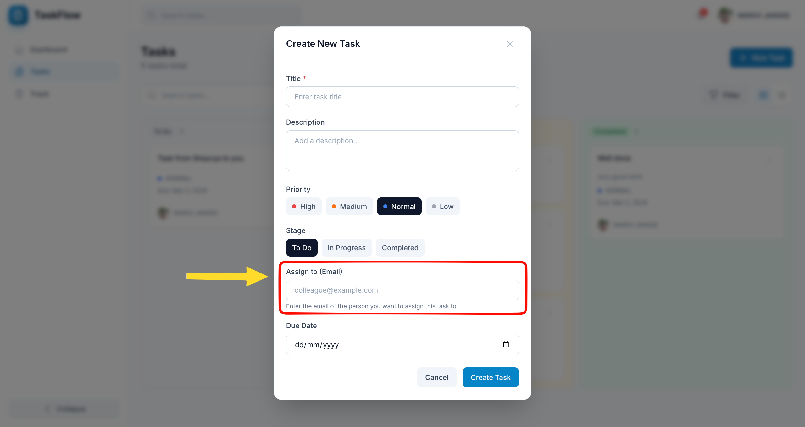


**When you assign a task:**

- The assignee receives an in-app notification
- The assignee receives a real-time Socket.IO event
- Activity log records the assignment
- Task appears in the assignee's "Assigned to Me" view

---


---

## Subtasks

Subtasks help break down complex tasks into smaller, manageable items.

### Adding Subtasks

1. Open a task by clicking on it
2. Scroll to the **Subtasks** section
3. Click **"Add Subtask"** or the **"+"** button
4. Enter the subtask title
5. Press **Enter** or click the add button
6. Repeat for additional subtasks

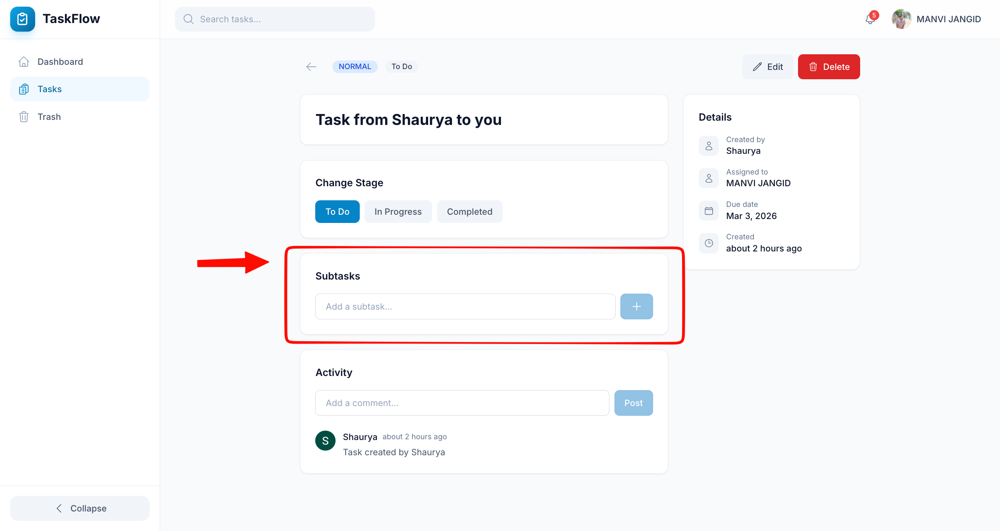

**Tips for effective subtasks:**

- Keep titles short and action-oriented
- Start with a verb (e.g., "Write", "Test", "Review")
- Aim for 3-7 subtasks per task
- Order subtasks by logical sequence

---

### Completing Subtasks

To mark a subtask as done:

1. Open the parent task
2. Find the subtask in the list
3. Click the **checkbox** next to the subtask
4. The subtask is marked as completed with a strikethrough

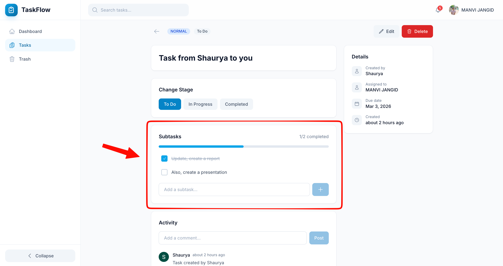

**Subtask Progress Tracking:**

- A progress bar shows completion percentage
- Format: "3 of 5 completed (60%)"
- Completing all subtasks doesn't auto-complete the parent task

---

## Activity & Comments

Every task maintains an activity timeline showing its history.

### Automatic Activity Tracking

The following actions are automatically logged:

| Activity Type | Description |
|---------------|-------------|
| **Created** | Task was created, showing creator name |
| **Updated** | Task fields were modified |
| **Assigned** | Task was assigned to someone |
| **Started** | Task moved to In Progress |
| **Completed** | Task marked as completed |
| **Commented** | User added a comment |

### Adding Comments

1. Open a task
2. Scroll to the **Activity** section
3. Find the comment input field
4. Type your comment
5. Click **"Add Comment"** or press **Enter**

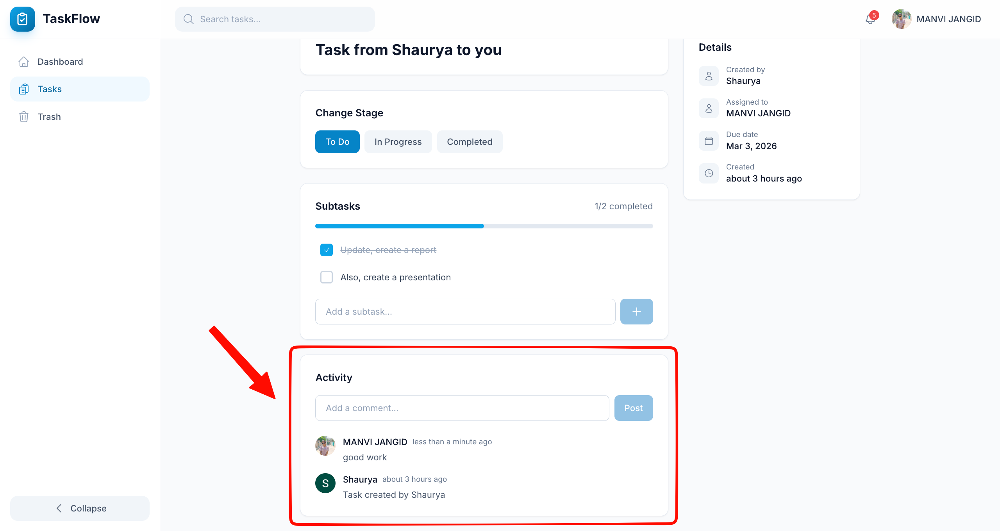

**Comment features:**

- Comments appear in chronological order
- Each comment shows author name and timestamp
- Comments are visible to all users with task access
- Comments trigger notifications to task participants

---

## Views & Filtering

### Board View

The Board View displays tasks in a Kanban-style layout:

```
┌─────────────┬─────────────┬─────────────┐
│    TODO     │ IN PROGRESS │  COMPLETED  │
├─────────────┼─────────────┼─────────────┤
│  [Task 1]   │  [Task 4]   │  [Task 6]   │
│  [Task 2]   │  [Task 5]   │  [Task 7]   │
│  [Task 3]   │             │  [Task 8]   │
└─────────────┴─────────────┴─────────────┘
```

**Using Board View:**

1. Navigate to **Tasks** in the sidebar
2. Click the **Board** icon in the view toggle
3. Tasks are organized in columns by stage
4. Drag and drop tasks between columns to change stage

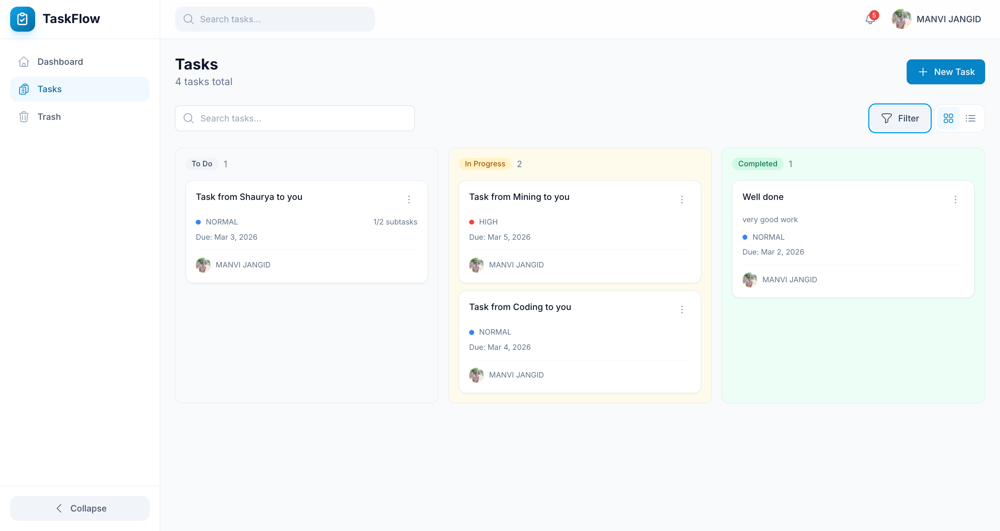

---

### List View

The List View displays tasks in a table format:

| Title | Priority | Stage | Assignee | Due Date |
|-------|----------|-------|----------|----------|
| Task 1 | High | TODO | John | Mar 15 |
| Task 2 | Medium | In Progress | Sarah | Mar 20 |

**Using List View:**

1. Navigate to **Tasks** in the sidebar
2. Click the **List** icon in the view toggle
3. Click column headers to sort
4. Click a row to open task details

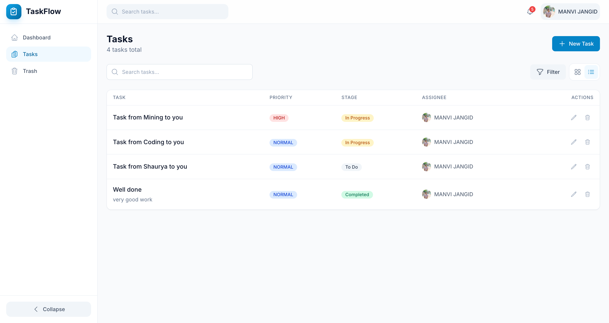

---

### Filtering Tasks

Filter tasks to find exactly what you need:

#### By Priority

1. Click the **Priority** filter dropdown
2. Select one or more priorities:
   - High
   - Medium
   - Normal
   - Low
3. Tasks are filtered instantly

#### By Stage

1. Click the **Stage** filter dropdown
2. Select stages to show:
   - TODO
   - In Progress
   - Completed

#### By View Type

1. Click the **View** filter dropdown
2. Choose:
   - **All Tasks**: Everything you have access to
   - **Created by Me**: Tasks you created
   - **Assigned to Me**: Tasks assigned to you

#### Search

1. Click the search icon or press `/`
2. Type your search query
3. Results filter in real-time by title and description

**Assigned to Me**: Tasks assigned to you
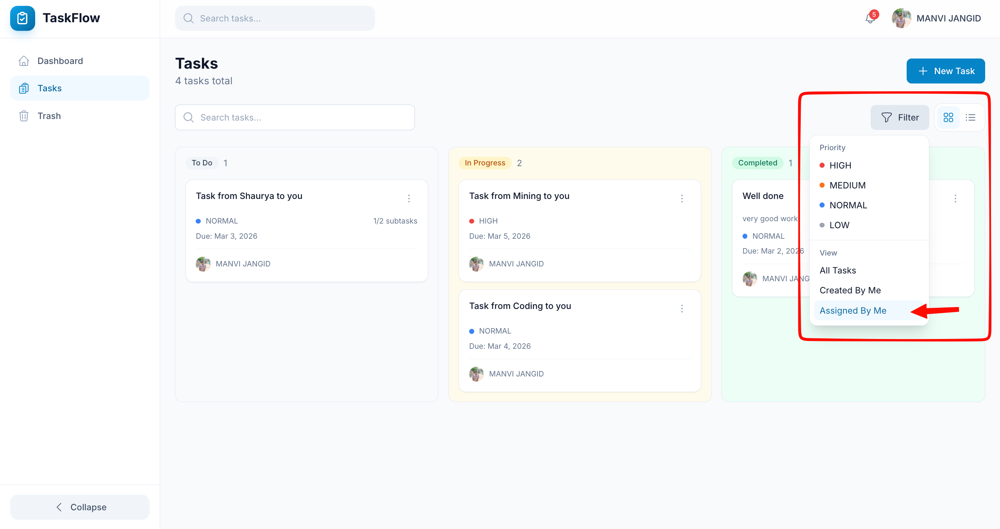

**Created by Me**: Tasks you created
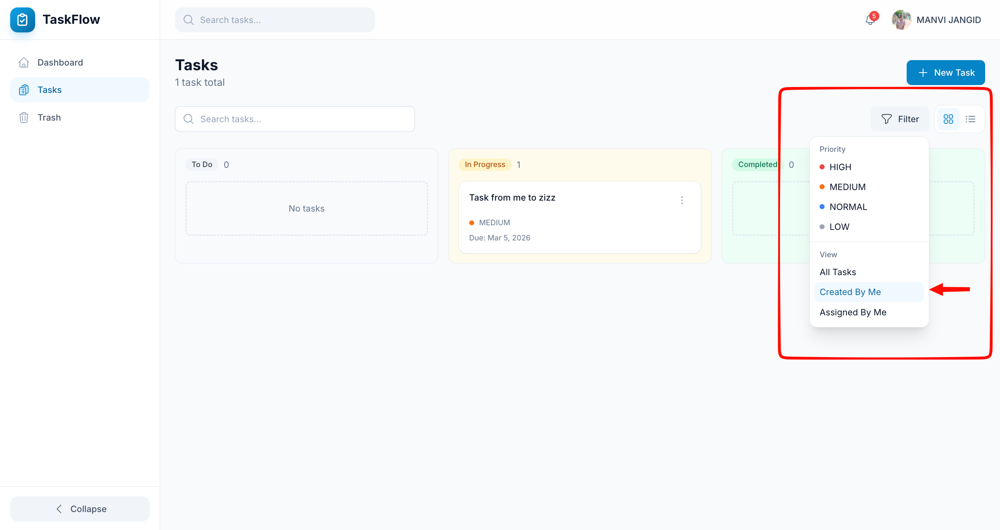

---

## Notifications

TaskFlow keeps you informed with real-time notifications.

### Notification Types

| Type | Description | Example |
|------|-------------|---------|
| **Assignment** | When someone assigns you a task | "John assigned you: Update documentation" |
| **Completed** | When an assigned task is completed | "Sarah completed: API integration" |
| **Alert** | System alerts and reminders | "Task due tomorrow: Submit report" |
| **Message** | Comments and mentions | "New comment on: Bug fix #123" |

### Viewing Notifications

1. Click the **Bell icon** in the top navigation
2. View your notification list
3. Unread notifications show a count badge
4. Click a notification to view the related task

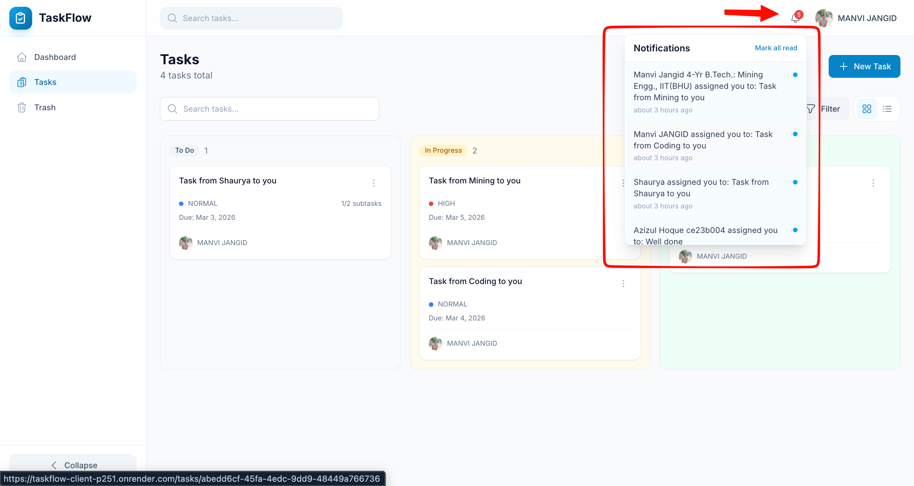

### Managing Notifications

- **Mark as Read**: Click on a notification to mark it read
- **Mark All Read**: Click "Mark all as read" to clear all
- Real-time updates via WebSocket connection

---

## Trash & Recovery

### Viewing Trashed Tasks

1. Click **Trash** in the sidebar
2. View all soft-deleted tasks
3. Tasks remain in trash until permanently deleted

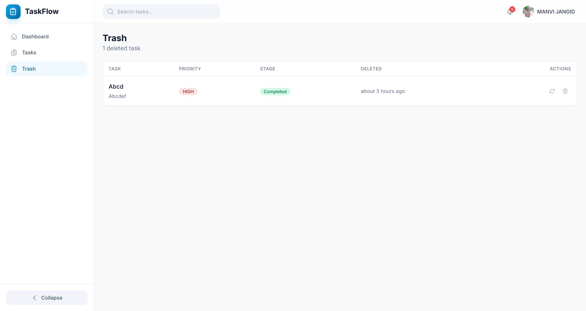

### Restoring a Task

1. Go to **Trash** in the sidebar
2. Find the task you want to restore
3. Click the **"Restore"** button (undo icon)
4. Task is moved back to its original stage

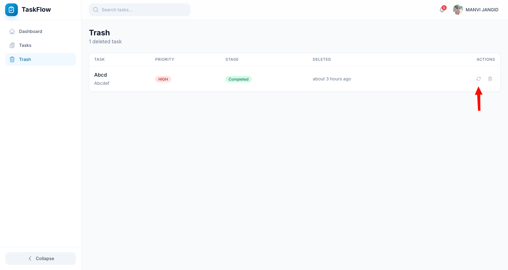

### Permanent Deletion

1. Go to **Trash** in the sidebar
2. Find the task to permanently delete
3. Click the **"Delete Forever"** button
4. Confirm in the dialog
5. Task is permanently removed

**Warning**: This action cannot be undone!

---

## Profile Settings

### Accessing Profile Settings

1. Click your **profile picture** or **name** in the top right
2. Select **"Profile"** or **"Settings"**

### Updating Your Profile

You can modify:

- **Display Name**: How your name appears to others
- **Profile Picture**: Upload a new image (or linked from Google)

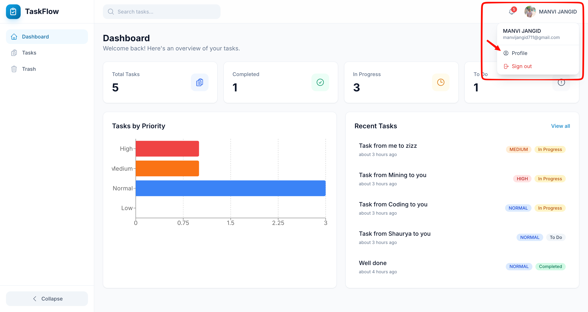

### Logging Out

1. Click your profile in the top right
2. Select **"Sign Out"**
3. You'll be redirected to the login page

---


---

## Quick Reference Card

### Task Workflow

```
CREATE → TODO → IN PROGRESS → COMPLETED → (TRASH) → DELETE
```

### Priority Legend

| Color | Priority | Usage |
|-------|----------|-------|
| 🔴 Red | High | Urgent, critical |
| 🟡 Yellow | Medium | Important |
| 🔵 Blue | Normal | Standard |
| ⚪ Gray | Low | Backlog |

### Stage Legend

| Color | Stage | Meaning |
|-------|-------|---------|
| ⚪ Gray | TODO | Not started |
| 🟡 Yellow | In Progress | Being worked on |
| 🟢 Green | Completed | Finished |

---
